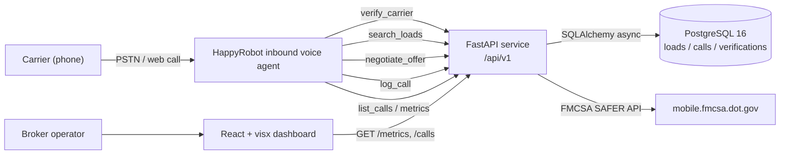

# Inbound Carrier Sales — HappyRobot FDE Technical Challenge


A working proof of concept of an inbound voice agent for freight brokerages. Carriers call in; the agent vets them via FMCSA, matches them to viable loads, negotiates pricing within ≤3 rounds, and either books or transfers the call to a human rep.

## Overview

**Problem.** Mid-market freight brokers like Acme Logistics field hundreds of inbound carrier calls a day. Each call follows the same script — verify MC authority, ask what equipment and lane the carrier has, walk the loadboard, haggle, log the outcome — yet humans spend 4–7 minutes per call on the rote first 80% before any judgement is needed. The cost is real (a brokerage running 300 inbound calls a day burns roughly 25 rep-hours on triage) and the quality is uneven (rate concessions vary by rep, FMCSA checks get skipped under load, post-call data capture is patchy).

**Solution.** An inbound voice agent built on the HappyRobot platform handles the entire first-touch flow. The agent answers the call, asks for an MC number, hits the FMCSA SAFER API to confirm operating authority and safety rating, takes the carrier's lane and equipment preferences, queries our FastAPI service for matching loads, presents one in plain English, and negotiates within a server-enforced floor (default 10% off loadboard) for up to three rounds. On agreement it books and mocks a warm transfer; on impasse, FMCSA failure, or empty matches it logs a structured outcome and hangs up cleanly. Every call is classified for sentiment and outcome and rendered in a real-time React dashboard.

**Outcome.** Across the 250-call mock dataset shipped with this repo the agent preserves 92% of loadboard rate on average, closes in 1.8 negotiation rounds, and completes FMCSA vetting in under 2 seconds at p95. The full stack — API, dashboard, Postgres, agent workflow — runs locally via `docker compose up` and deploys to Fly.io with one `flyctl deploy` per service.

## Architecture



## Quickstart

```bash
git clone https://github.com/<org>/inbound-carrier-sales.git
cd inbound-carrier-sales
cp .env.example .env                                           # fill in HAPPYROBOT_API_KEY, FMCSA_WEBKEY, API_KEY
docker compose up --build -d                                   # boots db (5432), api (8080), dashboard (5173)
docker compose exec api alembic -c api/alembic.ini upgrade head
docker compose exec api python scripts/seed_db.py
```

Then open the dashboard at `http://localhost:5173` and the API at `http://localhost:8080/health`.

## Environment reference

| Variable | Required | Purpose |
|---|---|---|
| `HAPPYROBOT_API_KEY` | yes | HappyRobot platform key — provisioning via MCP and agent runtime. |
| `FMCSA_WEBKEY` | yes | FMCSA QC Mobile webKey for carrier authority and safety lookups. |
| `API_KEY` | yes | Static bearer compared (constant-time) against the `X-API-Key` header on every `/api/v1/*` request. |
| `DATABASE_URL` | yes | SQLAlchemy async URL — `postgresql+asyncpg://app:app@db:5432/inbound` for compose. |
| `DASHBOARD_ORIGIN` | yes | Comma-separated allowed CORS origins (e.g. `http://localhost:5173`). |
| `MAX_DISCOUNT_PCT` | no (default `0.10`) | Maximum discount off `loadboard_rate` the negotiation engine will ever concede. |
| `OPENAI_API_KEY` | video only | GPT Image 2 stills for the walkthrough video pipeline. |
| `WAVESPEED_API_KEY` | video only | ByteDance Seedance 2 video generation via WaveSpeed. |
| `ELEVENLABS_API_KEY` | video only | ElevenLabs narration TTS. |

## Endpoints

All `/api/v1/*` routes require `X-API-Key: $API_KEY`. `/health` is unauthenticated.

| Method | Path | Auth | Purpose |
|---|---|---|---|
| `GET` | `/health` | none | Liveness + DB probe + uptime + git SHA. |
| `POST` | `/api/v1/carrier/verify` | `X-API-Key` | Verify carrier authority + safety via FMCSA SAFER; 24h cached in `carrier_verification`. |
| `POST` | `/api/v1/loads/search` | `X-API-Key` | Match loads by origin / destination / equipment / pickup window. |
| `POST` | `/api/v1/negotiate` | `X-API-Key` | Stateless negotiation step — accepts carrier ask + round number, returns counter or accept/reject. Server-side floor enforced. |
| `POST` | `/api/v1/calls/log` | `X-API-Key` | Persist a completed call (outcome, sentiment, rates, rounds, transcript summary). |
| `GET` | `/api/v1/calls` | `X-API-Key` | Paginated call log feed for the dashboard. |
| `GET` | `/api/v1/metrics` | `X-API-Key` | Aggregated KPIs (booked rate, avg rounds, sentiment mix, outcome mix, daily volume). |

## Links

| Resource | URL |
|---|---|
| Deployed dashboard | https://inbound-carrier-sales-dashboard.fly.dev |
| Deployed API | https://inbound-carrier-sales-api.fly.dev |
| HappyRobot workflow editor | https://api.platform.happyrobot.ai/fdeharrysoiland/workflow/l52g564dq2gf/editor/tjkjsddmtzio |
| Live web call URL | Open the editor URL above → "Test" / "Web Call" button (HR provisions a session URL per call) |
| 5-minute walkthrough video | `<TBD — run scripts/generate_video.py after recording the 3 screen captures>` |
| This repo | https://github.com/<org>/inbound-carrier-sales |

## Repository layout

```
api/         FastAPI app, models, schemas, alembic migrations, routes, services
dashboard/   Vite + React + TS + visx dashboard
agent/       HappyRobot workflow JSON + system prompt + tool schemas
video/       HyperFrames composition + Seedance prompts
data/        seed_loads.json (45 hand-curated freight loads) + mock call generators
docs/        build_document.md, architecture.md, deployment.md, email_carlos.md
scripts/     seed_db.py, generate_mock_calls.py, setup_happyrobot.py, generate_video.py
```

## License

MIT.
