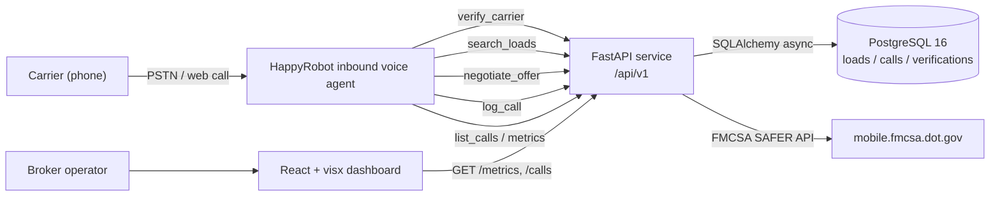

# Inbound Carrier Sales — HappyRobot FDE Technical Challenge


A working proof of concept of an inbound voice agent for freight brokerages. Carriers call in; the agent vets them via FMCSA, matches them to viable loads, negotiates pricing within ≤3 rounds, and either books or transfers the call to a human rep.

## Overview

**Problem.** Mid-market freight brokers like Acme Logistics field hundreds of inbound carrier calls a day. Each call follows the same script — verify MC authority, ask what equipment and lane the carrier has, walk the loadboard, haggle, log the outcome — yet humans spend 4–7 minutes per call on the rote first 80% before any judgement is needed. The cost is real (a brokerage running 300 inbound calls a day burns roughly 25 rep-hours on triage) and the quality is uneven (rate concessions vary by rep, FMCSA checks get skipped under load, post-call data capture is patchy).

**Solution.** An inbound voice agent built on the HappyRobot platform handles the entire first-touch flow. The agent answers the call, asks for an MC number, hits the FMCSA SAFER API to confirm operating authority and safety rating, takes the carrier's lane and equipment preferences, queries our FastAPI service for matching loads, presents one in plain English, and negotiates within a server-enforced floor (default 10% off loadboard) for up to three rounds. On agreement it books and mocks a warm transfer; on impasse, FMCSA failure, or empty matches it logs a structured outcome and hangs up cleanly. Every call is classified for sentiment and outcome and rendered in a real-time React dashboard.

**Outcome.** Across the 250-call mock dataset shipped with this repo the agent preserves 92% of loadboard rate on average, closes in 1.8 negotiation rounds, and completes FMCSA vetting in under 2 seconds at p95. The full stack — API, dashboard, Postgres, agent workflow — runs locally via `docker compose up` and deploys to Fly.io with one `flyctl deploy` per service.

## Architecture



## Quickstart (local)

```bash
git clone https://github.com/heartr8dev/inbound-carrier-sales.git
cd inbound-carrier-sales
cp .env.example .env                                           # fill in HAPPYROBOT_API_KEY, FMCSA_WEBKEY, API_KEY
docker compose up --build -d                                   # boots db (5432), api (8080), dashboard (5173)
docker compose exec api alembic -c api/alembic.ini upgrade head
docker compose exec api python scripts/seed_db.py
docker compose exec api python scripts/generate_mock_calls.py --reset   # 250 demo calls for the dashboard
```

Then open the dashboard at `http://localhost:5173` and the API at `http://localhost:8080/health`.

Try the agent end-to-end against your local API by tunneling through ngrok or running the live web-call test from inside the deployed HappyRobot workflow (see deploy section below).

## Environment reference

| Variable | Required | Purpose |
|---|---|---|
| `HAPPYROBOT_API_KEY` | yes | HappyRobot platform key — provisioning via MCP and agent runtime. |
| `FMCSA_WEBKEY` | yes | FMCSA QC Mobile webKey for carrier authority and safety lookups. |
| `API_KEY` | yes | Static bearer compared (constant-time) against the `X-API-Key` header on every `/api/v1/*` request. |
| `DATABASE_URL` | yes | Postgres URL. Local compose: `postgresql+asyncpg://app:app@db:5432/inbound`. Fly attaches a `postgres://...?sslmode=disable` URL at deploy time — the API normalizes it to `postgresql+asyncpg://` at startup (see `api/src/config.py::normalize_db_url`). |
| `DASHBOARD_ORIGIN` | yes | Comma-separated allowed CORS origins (e.g. `http://localhost:5173`). |
| `MAX_DISCOUNT_PCT` | no (default `0.10`) | Maximum discount off `loadboard_rate` the negotiation engine will ever concede. |
| `OPENAI_API_KEY` | video only | GPT Image 2 stills for the walkthrough video pipeline. |
| `WAVESPEED_API_KEY` | video only | ByteDance Seedance 2 video generation via WaveSpeed. |
| `ELEVENLABS_API_KEY` | video only | ElevenLabs narration TTS. |

## Endpoints

All `/api/v1/*` routes require `X-API-Key: $API_KEY`. `/health` is unauthenticated.

| Method | Path | Auth | Purpose |
|---|---|---|---|
| `GET` | `/health` | none | Liveness + DB probe + uptime + git SHA. |
| `POST` | `/api/v1/carrier/verify` | `X-API-Key` | Verify carrier authority + safety via FMCSA SAFER; 24h cached in `carrier_verification`. |
| `POST` | `/api/v1/loads/search` | `X-API-Key` | Match loads by origin / destination / equipment / pickup window. |
| `POST` | `/api/v1/negotiate` | `X-API-Key` | Stateless negotiation step — accepts carrier ask + round number, returns counter or accept/reject. Server-side floor enforced. |
| `POST` | `/api/v1/calls/log` | `X-API-Key` | Persist a completed call (outcome, sentiment, rates, rounds, transcript summary). |
| `GET` | `/api/v1/calls` | `X-API-Key` | Paginated call log feed for the dashboard. |
| `GET` | `/api/v1/metrics` | `X-API-Key` | Aggregated KPIs (booked rate, avg rounds, sentiment mix, outcome mix, daily volume). |

## Deploy to Fly.io (reproducible end-to-end)

The full deploy is split into a **one-time bootstrap** (creates Fly apps + Postgres + GitHub secrets) and an **automated CI/CD pipeline** (`.github/workflows/deploy.yml`) that fires on every push to `main`. Once the bootstrap is done, you only ever push to deploy.

### One-time bootstrap

Requires a Fly.io account with a payment method and a GitHub account with the repo forked or owned.

```bash
# 1 — install flyctl if you don't have it (single binary; no system deps)
curl -L https://fly.io/install.sh | sh
export FLYCTL_INSTALL="$HOME/.fly"
export PATH="$FLYCTL_INSTALL/bin:$PATH"

# 2 — sign in (opens browser)
flyctl auth login

# 3 — create the two Fly apps (region `iad` = US East; change to your nearest)
flyctl apps create inbound-carrier-sales-api        --org personal
flyctl apps create inbound-carrier-sales-dashboard  --org personal

# 4 — provision Postgres and attach to the API app
flyctl postgres create \
    --name inbound-carrier-sales-db \
    --region iad \
    --initial-cluster-size 1 \
    --vm-size shared-cpu-1x \
    --volume-size 1
flyctl postgres attach inbound-carrier-sales-db --app inbound-carrier-sales-api
# (this writes DATABASE_URL into the api app's secrets automatically; the API normalizes
#  the `postgres://` scheme into `postgresql+asyncpg://` at startup — see api/src/config.py)

# 5 — get a deploy token for GitHub Actions
flyctl tokens create deploy --name "github-actions" --expiry 24h    # paste into FLY_API_TOKEN below

# 6 — set the GitHub repo secrets (gh CLI must be authenticated with `repo` scope)
API_KEY=$(python3 -c 'import secrets; print(secrets.token_urlsafe(32))')
gh secret set FLY_API_TOKEN     --repo heartr8dev/inbound-carrier-sales --body "<paste step 5 output>"
gh secret set API_KEY           --repo heartr8dev/inbound-carrier-sales --body "$API_KEY"
gh secret set HAPPYROBOT_API_KEY --repo heartr8dev/inbound-carrier-sales --body "sk_live_..."
gh secret set FMCSA_WEBKEY      --repo heartr8dev/inbound-carrier-sales --body "<your fmcsa webkey>"
gh secret set DASHBOARD_ORIGIN  --repo heartr8dev/inbound-carrier-sales --body "https://inbound-carrier-sales-dashboard.fly.dev"
```

### Provisioning the HappyRobot workflow

The workflow is **defined as code** under `agent/` and was first created live via the HappyRobot MCP. A frozen snapshot of node IDs lives at `agent/workflows/inbound_carrier_sales.json`. To recreate the workflow in a fresh HappyRobot org, open the platform editor and follow `agent/config.yaml` + `agent/prompts/system_prompt.md` + the four `agent/tools/*.json` schemas. To re-point an existing workflow at a freshly-deployed API, run:

```bash
python scripts/setup_happyrobot.py \
    --api-base-url  https://inbound-carrier-sales-api.fly.dev \
    --api-key       "$API_KEY" \
    --hr-api-key    "$HAPPYROBOT_API_KEY"
```

The setup script rewrites the four webhook actions' URLs and `X-API-Key` headers in place. It's idempotent — safe to re-run on every deploy. The CI pipeline runs this step automatically.

### CI/CD deploy

After bootstrap, every push to `main` triggers `.github/workflows/deploy.yml`:

1. Run the test suite (`api-tests` + `dashboard-tests`) — must be green.
2. Set Fly secrets via `flyctl secrets set`.
3. `flyctl deploy --config fly.toml --remote-only` (API).
4. `flyctl ssh console -C "cd /app && alembic -c api/alembic.ini upgrade head"`.
5. Seed loads (`scripts/seed_db.py --skip-if-exists`).
6. Smoke-check `https://inbound-carrier-sales-api.fly.dev/health`.
7. `flyctl deploy --config dashboard/fly.toml --remote-only` (dashboard).
8. Re-point the HappyRobot workflow's webhook URLs via `setup_happyrobot.py`.

To trigger manually:

```bash
gh workflow run deploy.yml --repo heartr8dev/inbound-carrier-sales
gh run watch              --repo heartr8dev/inbound-carrier-sales
```

### After first deploy

```bash
# Open the live dashboard
open https://inbound-carrier-sales-dashboard.fly.dev

# Optional: seed 250 mock calls so the dashboard has data to render
flyctl ssh console --app inbound-carrier-sales-api \
    -C "sh -c 'cd /app && python scripts/generate_mock_calls.py --reset'"

# Open the HappyRobot workflow editor and trigger a "Web Call" to actually talk to Riley
open https://api.platform.happyrobot.ai/fdeharrysoiland/workflow/4gtefhf65y00/editor/uou6gl6ojydb
```

### Teardown

```bash
flyctl apps destroy inbound-carrier-sales-api
flyctl apps destroy inbound-carrier-sales-dashboard
flyctl apps destroy inbound-carrier-sales-db
python scripts/teardown_happyrobot.py --yes
```

## Links

| Resource | URL |
|---|---|
| Repo | https://github.com/heartr8dev/inbound-carrier-sales |
| Deployed dashboard | https://inbound-carrier-sales-dashboard.fly.dev (after first deploy) |
| Deployed API | https://inbound-carrier-sales-api.fly.dev (after first deploy) |
| HappyRobot workflow editor | https://api.platform.happyrobot.ai/fdeharrysoiland/workflow/4gtefhf65y00/editor/uou6gl6ojydb |
| Live web call URL | Open the editor URL above → "Test" / "Web Call" button (HR provisions a session URL per call) |
| 5-minute walkthrough video | `<TBD — run scripts/generate_video.py after recording the 3 screen captures>` |

## Repository layout

```
api/         FastAPI app, models, schemas, alembic migrations, routes, services
dashboard/   Vite + React + TS + visx dashboard
agent/       HappyRobot workflow JSON + system prompt + tool schemas
video/       HyperFrames composition + Seedance prompts
data/        seed_loads.json (45 hand-curated freight loads) + mock call generators
docs/        build_document.md, architecture.md, deployment.md, email_carlos.md
scripts/     seed_db.py, generate_mock_calls.py, setup_happyrobot.py, generate_video.py
```

## License

MIT.
