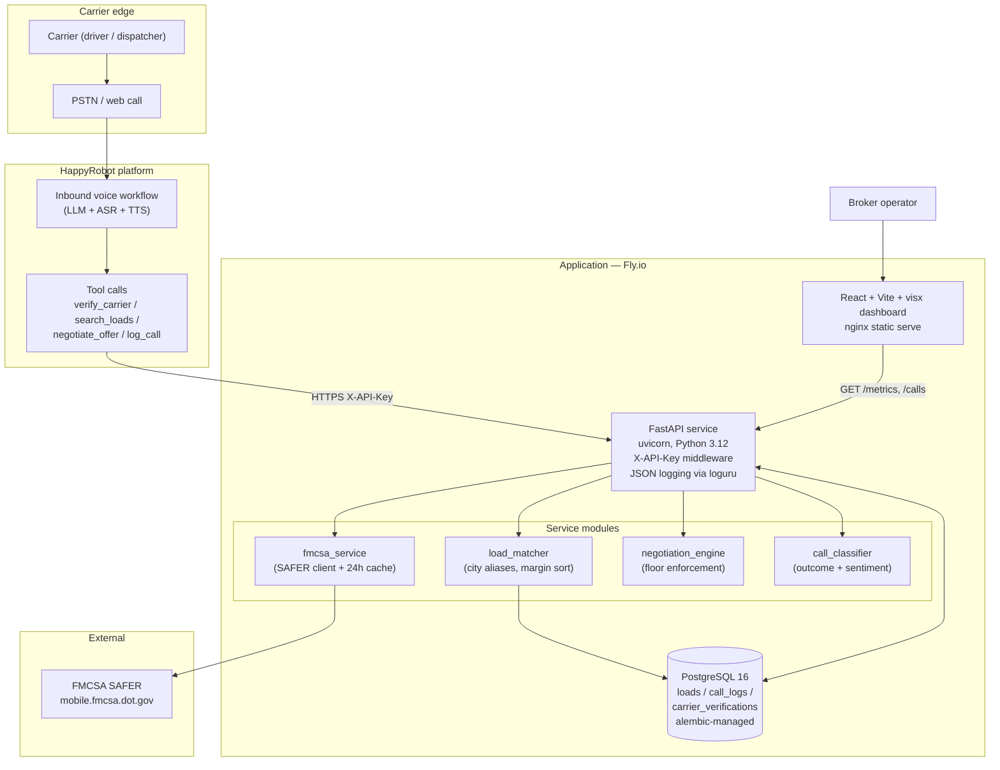
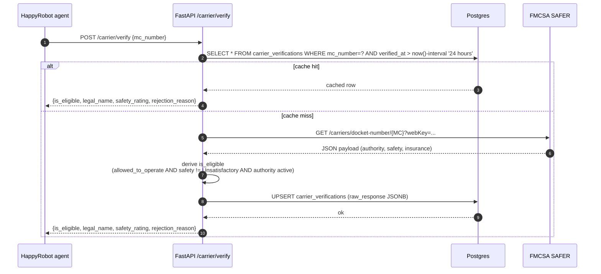
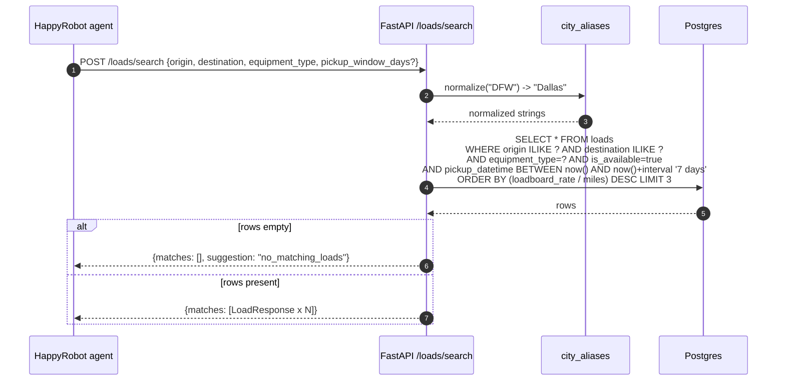
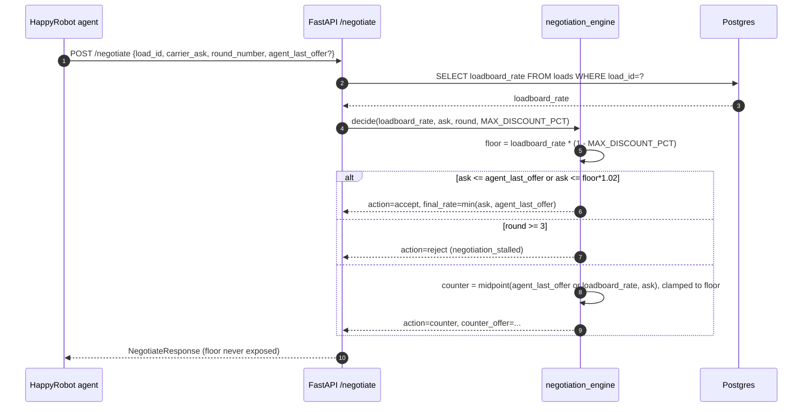
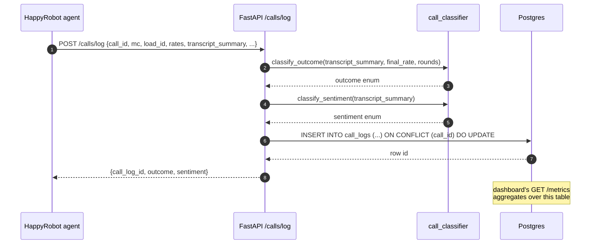

# Architecture

## System diagram

## Sequence: carrier verification

## Sequence: load search

## Sequence: negotiation

## Sequence: call log + extraction

## Why this stack

**FastAPI + SQLAlchemy 2.x (async) + Pydantic v2.** FastAPI gives us OpenAPI for free, which means the HappyRobot agent's tool schemas can be generated from the same source as the API contract; Pydantic v2 handles request validation and response shaping with zero boilerplate; SQLAlchemy 2's async API and the asyncpg driver get us real concurrent throughput on Postgres without thread-pool gymnastics. Alembic gives us reversible migrations on a single source of truth. Python is also the path of least resistance for the LLM-adjacent classifier and FMCSA-response normalisation work.

**PostgreSQL 16.** A real relational store is the right shape for this data: loads, calls, and carrier verifications all have foreign-key relationships and benefit from indexes (`equipment_type`, `pickup_datetime`, `mc_number`, `created_at`). JSONB lets us stash the raw FMCSA payload for audit without designing a new schema for every field. Fly Postgres makes provisioning a one-liner.

**React + Vite + TypeScript + visx.** Vite gives us a sub-second dev loop; TypeScript pairs with the OpenAPI client we generate from the API for end-to-end type safety. visx is Airbnb's D3-on-React — it's exactly the right primitive for a metrics dashboard that needs SVG export for slide decks, fine-grained chart customization (stacked bars, donut, sparklines), and a small bundle. Recharts would have been faster to wire up but harder to push to the level of polish we want for a customer-facing demo.

**HappyRobot.** The whole point of the exercise. The workflow editor is config-as-code, version-controlled, and audit-logged; the agent runtime handles ASR, TTS, LLM, and tool calling so we don't have to. Provisioning via the MCP server means the workflow build is reproducible from a Python script.

**Docker + Fly.io.** Compose for local parity (db + api + dashboard in one `up`). Fly for production: edge-terminated HTTPS, automatic Let's Encrypt, attached Postgres, secrets management, log streaming, and rollbacks via `flyctl releases`. One target, two services, no Kubernetes overhead.
