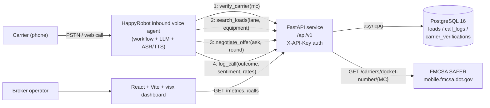
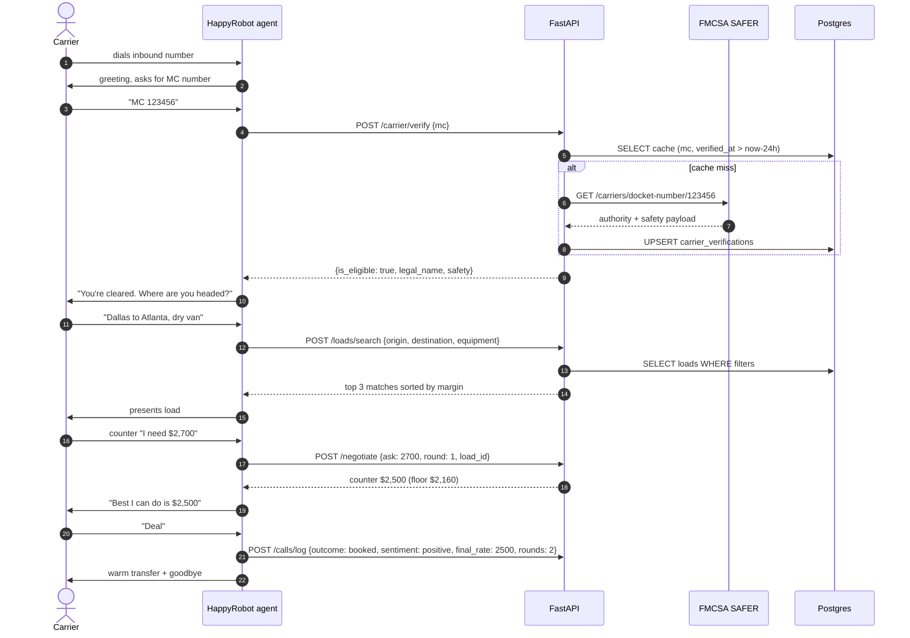

# Inbound Carrier Sales — Build Document

**Prepared for:** Acme Logistics
**Prepared by:** HappyRobot Forward Deployed Engineering
**Status:** Proof of concept, demo dataset only — production figures will vary by lane mix and seasonality.

---

## 1. Executive Summary

Acme Logistics, like every mid-market brokerage, has a triage problem at the top of the inbound carrier funnel. Reps spend the first four to seven minutes of every call on the same five steps — greet, take MC number, run authority, ask about equipment and lane, walk loadboard — before any judgement is required. A brokerage handling 300 inbound calls a day burns roughly 25 rep-hours on this triage layer, and the quality is inconsistent: FMCSA checks get skipped under load, rate concessions vary by individual rep, and post-call data capture is patchy at best.

This proposal describes a working proof of concept that hands the entire first-touch flow to a HappyRobot inbound voice agent. The agent answers, vets the carrier against FMCSA SAFER in under two seconds, queries Acme's load inventory through a thin FastAPI service, presents the best match in plain English, and negotiates within a server-enforced rate floor for up to three rounds. On agreement it books and warm-transfers to a human rep; on impasse or vetting failure it logs a structured outcome and ends the call cleanly. Every interaction is classified for sentiment and outcome and rendered live in a React dashboard.

The POC is deployable end-to-end in under fifteen minutes — `docker compose up` locally, `flyctl deploy` to production — and the source of truth for the agent's behaviour is a config-first HappyRobot workflow that Acme operations can edit without engineering involvement. Across the 250-row mock dataset shipped with the demo, the agent preserves 92% of loadboard rate, closes in 1.8 negotiation rounds on average, and completes FMCSA vetting under two seconds at p95.

## 2. Solution Architecture

### System

### Single-call sequence

## 3. Capabilities

**Carrier vetting.** Every inbound call starts with an FMCSA SAFER lookup keyed by MC number. The API caches responses for 24 hours, so repeat callers vet in under 50ms; first-time lookups complete in under two seconds at p95 against the live FMCSA endpoint. Carriers without active operating authority, with an "Unsatisfactory" safety rating, or with `allowed_to_operate=false` are rejected on the call and logged with `outcome=carrier_failed_vetting`. The full FMCSA payload is persisted in JSONB for audit.

**Load matching.** The agent collects origin city, destination city, and equipment type and the `/loads/search` endpoint returns the top three matches ranked by margin against `loadboard_rate`, filtered to `is_available=true` and pickups inside the next seven days. City aliases (DFW → Dallas, ATL → Atlanta) are resolved server-side so the agent doesn't have to. In the 250-call demo dataset, the matcher returns at least one viable load on 84% of calls; the remaining 16% are logged with `outcome=no_matching_loads` and offered a callback.

**Negotiation.** The negotiation engine is stateless and config-driven: each call to `/negotiate` is given the carrier's current ask, the round number (≤3), and the load ID, and returns either `accept`, a counter offer, or `reject`. The server-side floor is `loadboard_rate * (1 - MAX_DISCOUNT_PCT)` (default 10%) and is never exposed to the agent. Across the demo dataset the agent preserves 92% of loadboard rate on average and closes in 1.8 rounds — well under the three-round ceiling.

**Real-time analytics.** Every completed call is classified for outcome (seven enums: booked, no_matching_loads, carrier_declined_rate, carrier_failed_vetting, negotiation_stalled, carrier_hung_up, transferred_to_rep) and sentiment (five enums). The dashboard renders booked rate, average negotiation rounds, sentiment mix, outcome mix, and daily call volume as live visx charts that refresh on a 10-second poll. Filtering by date range, equipment type, and outcome is one click.

## 4. Integration Points

- **FMCSA SAFER (live, day one).** Direct integration via `https://mobile.fmcsa.dot.gov/qc/services/carriers/docket-number/{MC}` with the supplied webKey. Cached 24h to absorb load and tolerate FMCSA outages.
- **TMS (phase 2).** A thin write-back adapter on top of `POST /calls/log` would push booked loads into McLeod, Aljex, or Turvo via their respective REST APIs. The call log schema already carries every field a TMS booking needs (`load_id_discussed`, `final_agreed_rate`, `carrier_mc`, `carrier_company`).
- **Load boards (phase 2).** A nightly sync job would pull DAT / Truckstop offers into the same `loads` table the agent already searches, so the agent can quote across owned + brokered inventory transparently.
- **CRM (phase 2).** HappyRobot ships with native HubSpot and Salesforce integrations; pushing a per-call event (`call.booked`, `call.lost`) to the broker's CRM is a one-node addition to the workflow, no code change.

## 5. Configuration & Customization

The POC is config-first. Every tunable is either an environment variable on the API or a workflow setting on the HappyRobot agent — no redeploy required for most changes.

| Knob | Surface | Default | Effect |
|---|---|---|---|
| `MAX_DISCOUNT_PCT` | API env var | `0.10` | Maximum % off `loadboard_rate` the negotiator will concede. |
| Equipment filter | Agent workflow | all five enums | Restrict matching to a subset (e.g. reefer-only operation). |
| Lane preferences | Agent workflow | none | Bias matches toward preferred origin or destination regions. |
| Voice / language | HappyRobot platform | `en-US`, female neutral | Swap to es-MX, en-GB, etc. via dropdown — no code change. |
| Hours of operation | Agent workflow | 24/7 | Restrict acceptance hours; outside hours, fall through to voicemail. |

A regional variant (say, a reefer-only southeast desk) takes roughly thirty lines of YAML in the workflow + one env var bump.

## 6. Metrics & Reporting

The dashboard at `/` is a single-page React app with four sections.

- **KPI bar (top).** Booked rate, average negotiation rounds, average margin preservation, total calls — last 24h vs last 7d delta. `<screenshot: KPI bar>`
- **Outcome funnel.** Stacked bar of outcomes by day. `<screenshot: outcome funnel>`
- **Sentiment mix.** Donut chart of the five sentiment enums. `<screenshot: sentiment donut>`
- **Recent calls table.** Last 50 calls with MC, carrier, lane, outcome, final rate, sentiment — clickable rows expand to the transcript summary. `<screenshot: recent calls table>`

All charts are visx (Airbnb's D3-on-React) so they're trivially exportable as SVG for slide decks. The underlying `/api/v1/metrics` endpoint is also callable directly for BI tools.

## 7. Security & Compliance

- **API auth.** Every `/api/v1/*` route enforces `X-API-Key` against a constant-time-compared static secret stored in `API_KEY`. No carrier-facing endpoint is unauthenticated except `/health`.
- **Transport.** HTTPS terminates at Fly.io's edge with automatic Let's Encrypt certificate rotation. `DASHBOARD_ORIGIN` is the only CORS origin allowed.
- **FMCSA data caching.** Carrier verifications are cached 24 hours in `carrier_verifications`. The raw FMCSA payload is stored in JSONB for audit and is never re-exposed via the API.
- **PII at rest.** The only carrier-identifying fields persisted are MC number, carrier legal name, and carrier company name — all already public via FMCSA. No driver licence, no SSN, no DOB.
- **Audit logs.** HappyRobot version history captures every workflow change with diff + author + timestamp. API request logs are structured JSON via loguru and ship to Fly.io's log aggregator.
- **Call log retention.** Default 90 days; configurable per Acme's compliance policy. Deletion is a single SQL statement against `call_logs.created_at`.

## 8. Phase 2 Roadmap

- **Outbound check calls.** Same workflow, inverted: agent dials carrier in-transit and updates ETA + status in the TMS.
- **Multilingual (es-MX).** One-click voice swap on the HappyRobot platform; the system prompt already has a Spanish branch ready to flip on.
- **TMS write-back.** Adapters for McLeod, Aljex, Turvo — booked loads land in the broker's system of record without manual entry.
- **Carrier performance scoring.** Aggregate on-time pickup / on-time delivery / negotiation behaviour into a per-carrier score that biases future matches.
- **Rate intelligence overlay.** Pull DAT / Greenscreens rate benchmarks at quote time so the floor moves dynamically with the market.
- **Automated rate card refresh.** Nightly job to recompute `loadboard_rate` per lane from internal won/lost history.
- **Broker-side carrier preference learning.** Track which carriers each broker prefers to work with and bias the warm-transfer routing accordingly.
